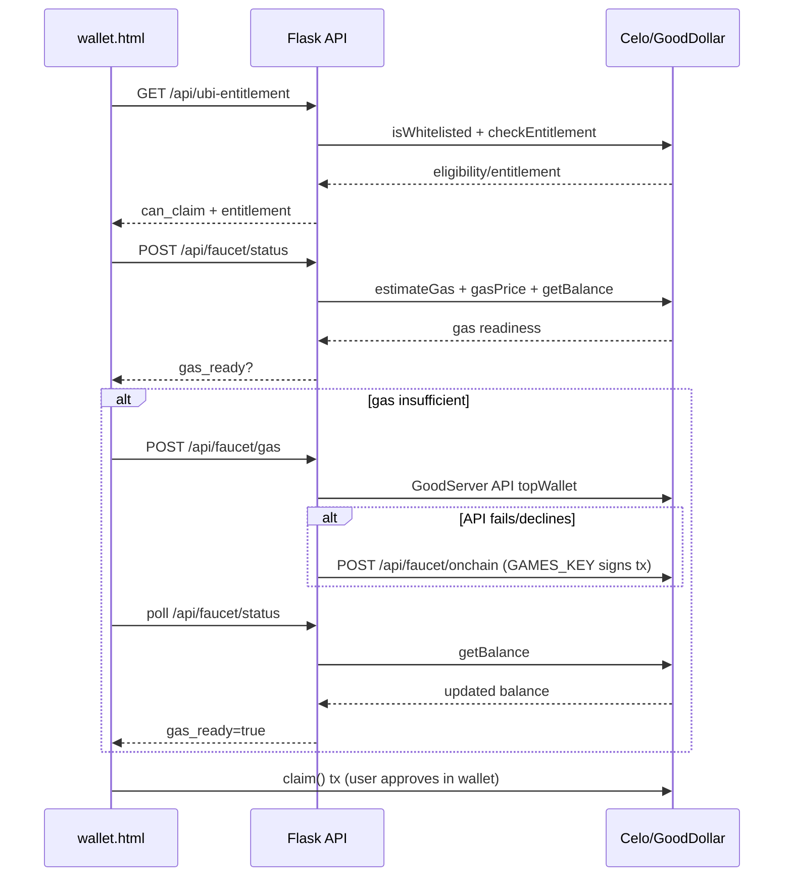

# GoodMarket

A Web3 earning platform built on the GoodDollar ecosystem. Users earn G$ tokens on the Celo network through educational quizzes, social media tasks, minigames, and community engagement.


## Source Availability Notice

This repository is maintained as a community initiative by the project author and is not open for public source reuse.

- **License status:** All rights reserved.
- **Contributions:** By invitation/maintainer approval only.
- **Reuse/redistribution:** Not permitted without prior written permission from the author.

## Tech Stack

- **Backend:** Python 3.12, Flask, Gunicorn (gthread workers)
- **Frontend:** Server-side rendered Jinja2 templates with static assets
- **Database:** Supabase (PostgreSQL)
- **Blockchain:** Web3.py, Celo network, GoodDollar (G$) contracts
- **WalletConnect:** Node.js sidecar service (`wc_service.js`) using `@walletconnect/sign-client`
- **Package Manager (Python):** uv (with `uv.lock` and `pyproject.toml`)
- **Package Manager (Node):** npm (`package.json`)

## Project Layout

| Path | Description |
|------|-------------|
| `main.py` | Flask app entry point, initializes all services and blueprints |
| `routes.py` | Core API routes and auth decorators |
| `blockchain.py` | Blockchain logic (UBI claims, G$ balances) |
| `config.py` | Global configuration and reward settings |
| `supabase_client.py` | Database connection and utilities |
| `gunicorn.conf.py` | Gunicorn server configuration (port 5000, 0.0.0.0) |
| `wc_service.js` | Node.js WalletConnect service (runs on port 3001) |
| `learn_and_earn/` | Learn & Earn quiz module |
| `minigames/` | Minigames module |
| `twitter_task/` | Twitter social task module |
| `telegram_task/` | Telegram social task module |
| `discourse_task/` | Discourse forum task module |
| `savings/` | G$ Savings module (time-locked deposits, sponsor reward pool) |
| `contracts/GDSavings.sol` | Smart contract for savings — deployed to Celo Mainnet |
| `contracts/deploy_savings_contract.py` | Deployment script using SAVING_KEY |
| `community_stories/` | Community stories module |
| `jumble/` | Jumble word game module |
| `price_prediction/` | Price prediction module |
| `referral_program/` | Referral program module |
| `contracts/` | Solidity smart contracts and deployment scripts |
| `static/` | Static assets (JS bundles, icons, manifest) |
| `templates/` | Jinja2 HTML templates |

## Workflow

- **Start application:** `uv run gunicorn --config gunicorn.conf.py main:app`
- Runs on port **5000** (0.0.0.0)
- WalletConnect sidecar runs on port **3001** (started automatically by main.py if `WALLETCONNECT_PROJECT_ID` is set)

## Required Environment Variables / Secrets

The app gracefully degrades when these are missing, but full functionality requires:

- `SUPABASE_URL` — Supabase project URL
- `SUPABASE_ANON_KEY` — Supabase API key
- `SUPABASE_SERVICE_ROLE_KEY` — Supabase service-role key (server-side only). Required to upload P2P payment-proof attachments to the private `payment-proofs` Storage bucket.
- `SECRET_KEY` — Flask session secret key
- `WALLETCONNECT_PROJECT_ID` — WalletConnect project ID
- `CELO_RPC_URL` — Celo RPC endpoint (defaults to `https://forno.celo.org`)
- `GOODDOLLAR_CONTRACT` — GoodDollar token contract address
- `MERCHANT_ADDRESS` — Merchant wallet address for minigames
- `GAMES_KEY` — Private key for games blockchain transactions
- `COMMUNITY_KEY` — Private key for community stories rewards
- `PRODUCTION_DOMAIN` — Production domain (defaults to `https://goodmarket.live`)

### Learn & Earn Streaming Payouts (optional)

Learn & Earn supports paying quiz rewards as a Superfluid stream over a configurable duration instead of as a single instant transfer. The flow is off by default and falls back to the legacy instant transfer automatically when any prerequisite is missing, so leaving these env vars unset keeps the current behaviour intact.

- `LEARN_EARN_PAYOUT_MODE` — `instant` (default) or one of `stream` / `stream_1day` / `streaming` / `stream_payout` to enable streaming. When set to a streaming alias, the quiz submit path queues a row in `learn_earn_streams` instead of sending G$ directly.
- `LEARN_EARN_STREAM_DURATION_SECONDS` — Stream duration. Default `86400` (1 day).
- `LEARN_EARN_STREAM_TOKEN_ADDRESS` — Address of the GoodDollar SuperToken (Superfluid-compatible wrapper) on Celo. Required.
- `GOODDOLLAR_SUPERTOKEN_ADDRESS` — Alternate name accepted for the SuperToken address above (the first one set wins).
- `SUPERFLUID_HOST_ADDRESS` — Superfluid Host contract on Celo. Required.
- `SUPERFLUID_CFA_V1_ADDRESS` — Superfluid Constant Flow Agreement v1 contract on Celo. Required.
- `LEARN_EARN_STREAM_SCHEDULER_ENABLED` — Force the in-process stream worker on (`1`) or off (`0`). Defaults to ON whenever `LEARN_EARN_PAYOUT_MODE` is a streaming alias.
- `LEARN_EARN_STREAM_WORKER_INTERVAL_SECONDS` — How often the in-process worker wakes up. Default `120` (2 min). Minimum `15`.
- `LEARN_EARN_STREAM_WORKER_START_BATCH` — Max `pending_start` rows processed per cycle. Default `50`.
- `LEARN_EARN_STREAM_WORKER_STOP_BATCH` — Max due `active`/`pending_stop` rows stopped per cycle. Default `100`.
- `LEARN_EARN_STREAM_WORKER_BOOT_DELAY_SECONDS` — How long each worker waits before its first cycle on boot. Default `20`.
- `LEARN_EARN_STREAM_WORKER_TOKEN` — Bearer token for `POST /learn-earn/process-streams`. Only needed if you want to trigger the worker manually from an external cron or ops shell; the in-process scheduler does not use it.

Before flipping `LEARN_EARN_PAYOUT_MODE` to streaming, apply the migration in `sql/learn_earn_streaming_payouts.sql` to your Supabase project. If the table is missing the quiz submit path will log a warning and fall back to instant rewards automatically — users will not see an error, but no streaming will happen until the table exists.

## Admin Feature Visibility Controls

Admins can show or hide the `/swap` and `/wallet` pages from the admin dashboard under the **Feature Visibility** section. When hidden, users visiting those pages are shown a friendly "Feature Unavailable" page instead.

- Settings stored in the `maintenance_settings` Supabase table using `feature_name` values `swap_feature` and `wallet_feature`.
- Public API: `GET /api/feature-visibility` — returns `{ swap_visible, wallet_visible }`.
- Admin API: `GET/POST /api/admin/feature-visibility` — reads/updates settings (admin auth required).
- New template: `templates/feature_unavailable.html` — shown when a feature is hidden.

## Daily Voucher Feature

A daily payment link voucher that appears on all user dashboards every day at **2PM PHT** (UTC+8) and disappears the moment someone claims it.

### How it works
1. **Admin** goes to Admin Dashboard → **Daily Voucher** → pastes the payment link URL → clicks Save.
2. At 2PM PHT, a golden animated banner appears on every logged-in user's dashboard with a **"Claim GoodMarket Voucher"** button.
3. The **first user** to click the button claims it — the banner immediately disappears for everyone.
4. The admin can Reset the claim status to make it claimable again if needed.

### Database table required
Run `create_daily_voucher_table.sql` in your Supabase SQL Editor to create the `daily_voucher` table before using this feature.

### API endpoints
| Method | Endpoint | Auth | Description |
|--------|----------|------|-------------|
| GET | `/api/voucher/daily` | User | Returns active voucher if after 2PM PHT |
| POST | `/api/voucher/claim` | User | Claims the voucher (first-come-first-served) |
| GET | `/api/admin/voucher` | Admin | Gets today's voucher status |
| POST | `/api/admin/voucher` | Admin | Sets/updates the voucher link |
| POST | `/api/admin/voucher/reset` | Admin | Resets claim status |

## UBI claim + gas fallback flow

The wallet claim flow now performs a safe sequence before sending `claim()`:

1. **Entitlement check** (`GET /api/ubi-entitlement`)  
   - Checks identity whitelist first (`isWhitelisted`).  
   - If verified, checks UBI entitlement (`checkEntitlement(wallet)`).  
   - Returns `is_verified`, `can_claim`, `entitlement`, `entitlement_formatted`, and `reason` when blocked.
2. **Gas readiness check** (`POST /api/faucet/status`)  
   - Estimates claim gas reserve (`eth_estimateGas * eth_gasPrice` with buffer).  
   - Compares required reserve vs CELO wallet balance.
3. **Faucet attempt** (`POST /api/faucet/gas`)  
   - Calls GoodDollar faucet API first.  
   - Falls back to on-chain top-up if API fails.
4. **On-chain fallback** (`POST /api/faucet/onchain`)  
   - Uses `GAMES_KEY` server-side to call faucet `topWallet(address)`.
5. **Balance poll + claim tx**  
   - Frontend waits for CELO balance increase, then prompts user to approve `claim()`.

### Sequence diagram



### Basic test checklist

- Happy path: verified wallet + enough CELO → direct claim prompt.
- Happy path: verified wallet + low CELO → faucet API top-up → claim succeeds.
- Fallback path: faucet API fails → on-chain fallback tx via `GAMES_KEY` succeeds.
- Failure: wrong connected wallet → user gets actionable wallet mismatch error.
- Failure: not verified / no entitlement → claim button disabled with clear reason.
- Failure: faucet unavailable or timeout → clear retry/support message.
- Failure: user rejects signature or tx → cancellation message shown.
- Duplicate protection: repeated refill attempts within 30 minutes are blocked.

## Deployment

### Replit Autoscale
Configured for **autoscale** deployment. Run command: `gunicorn --config gunicorn.conf.py main:app`

The WalletConnect sidecar (`wc_service.js`) is started automatically by the Flask app at runtime if `WALLETCONNECT_PROJECT_ID` is set — no separate process needed in deployment.

### Vercel
- `vercel.json` is configured to deploy the Flask app using `@vercel/python`
- `.vercelignore` excludes large/unnecessary files (node_modules, .pythonlibs, uv.lock, etc.)
- `requirements.txt` contains all Python dependencies for Vercel to install
- WalletConnect sidecar is gracefully skipped on Vercel (Node.js subprocess not available in serverless Python runtime; browser-side WalletConnect fallback is used)
- All environment variables must be set in the Vercel project dashboard

**Required Vercel Environment Variables:**
| Variable | Description |
|----------|-------------|
| `SECRET_KEY` | Flask session secret key |
| `SUPABASE_URL` | Supabase project URL |
| `SUPABASE_ANON_KEY` | Supabase anonymous/service key |
| `SUPABASE_SERVICE_ROLE_KEY` | Supabase service-role key (server-side only; uploads P2P payment proofs) |
| `WALLETCONNECT_PROJECT_ID` | WalletConnect project ID |
| `CELO_RPC_URL` | Celo RPC endpoint (default: `https://forno.celo.org`) |
| `GOODDOLLAR_CONTRACT` | GoodDollar token contract address |
| `LEARN_WALLET_PRIVATE_KEY` | Private key for Learn & Earn reward disbursement |
| `LEARN_EARN_CONTRACT_ADDRESS` | Learn & Earn smart contract address |
| `DAILY_TASK_CONTRACT_ADDRESS` | Daily Task smart contract address (legacy — no longer used at runtime; kept for the historical deploy script) |
| `DAILYTASK_KEY` | Private key for the wallet that pays Twitter / Telegram daily-task rewards via direct G$ ERC-20 transfers |
| `COMMUNITY_KEY` | Private key for community stories rewards |
| `GAMES_KEY` | Private key for minigame transactions |
| `REFERRAL_KEY` | Private key for referral rewards |
| `DISCOURSE_TASK_KEY` | Private key for Discourse task rewards |
| `IMGBB_API_KEY` | ImgBB API key for image uploads |
| `PRODUCTION_DOMAIN` | Production domain (e.g. `https://goodmarket.live`) |
| `PAYMENT_LINK_ENC_KEY` | Encryption key for payment links |
| `CELOSCAN_API_KEY` | Celoscan API key (optional) |
| `TELEGRAM_BOT_TOKEN` | Bot token from BotFather (required for Telegram bot routes) |
| `TELEGRAM_WEB_APP_URL` | Public base URL opened by Telegram Mini App buttons (e.g. `https://good-market-community.vercel.app`) |
| `TELEGRAM_WEBHOOK_SECRET_TOKEN` | Optional shared secret for validating Telegram webhook calls |

## Savings v5 — Custom Lock Days & USDT

The G$ Savings vault was redeployed as **GDSavings v5** to give savers full
control over the lock period and to accept USDT alongside G$, CELO, and cUSD.

### What changed vs. v4

| | **v4** (previous) | **v5** (current) |
|---|---|---|
| Lock durations | Fixed ladder: 1, 30, 60, …, 330, 365 days | **Any integer from 1 to 360 days** — saver chooses |
| Tokens accepted | G$, CELO, cUSD | G$, CELO, cUSD, **USDT** (6-decimal, native USD₮ on Celo) |
| Tester bonus | 1 day → +30 G$ | **1–29 days** → +30 G$ (any amount ≥ per-token MIN) |
| Mid-tier bonus | 30–330d, step of 30 → `(lockDays/30) × 500 G$` | **30–360d, every day** → `⌊lockDays × 500 / 30⌋ G$` (≈16.67 G$/day, linear) |
| Loyalty bonus | 365d only → +20,000 G$ | **300–360d**, amount ≥ 1M G$ equiv → +20,000 G$ (replaces mid-tier) |
| Top-up rules | Inherits original unlock date | Inherits original unlock date (unchanged) |
| Early withdrawal | Not allowed | Not allowed (unchanged) |

The legacy v4 contract is **immutable on-chain** and remains the source of
truth for deposits that were opened before the v5 redeploy. The Savings UI
exposes a separate read-only **"Legacy Saves (v4 · READ-ONLY)"** panel that
lets affected wallets withdraw matured v4 slots — new deposits and top-ups
always go to v5.

### Per-token deposit limits

| Token | Decimals | Min deposit | Max deposit |
|-------|----------|-------------|-------------|
| G$    | 18 | 1,000 | 10,000,000 |
| CELO  | 18 | 1 | 100,000 |
| cUSD  | 18 | 1 | 1,000,000 |
| USDT  | **6**  | 1 | 1,000,000 |

`100k G$ equivalent` = 100,000 G$ / 100 CELO / 100 cUSD / 100 USDT  
`1M G$ equivalent`  = 1,000,000 G$ / 1,000 CELO / 1,000 cUSD / 1,000 USDT

### Deploying v5

Run the deployment script with `SAVING_KEY` set to the deployer wallet's
private key. The USDT address defaults to native Tether on Celo
(`0x48065fbBE25f71C9282ddf5e1cD6D6A887483D5e`); override `USDT_TOKEN_ADDRESS`
to deploy against a different USDT contract.

```bash
uv run python contracts/deploy_savings_contract.py
```

The script writes the new contract address + ABI to
`contracts/savings_deployment_info.json`. After a successful deploy:

1. Update `SAVINGS_CONTRACT_ADDRESS` in the deployment environment.
2. Set `LEGACY_V4_CONTRACT_ADDRESS=0x78d2a6Dd976337d3bEaFA0c30df6a0fDE949a618`
   so the legacy v4 panel can read existing slots. The pre-v5 deployment
   info is preserved at `contracts/savings_deployment_info_v4.json` for
   reference.
3. Set `USDT_TOKEN_ADDRESS` to match the address used at deploy time
   (defaults match the script).
4. If the new v5 deploy block differs from the v4 deploy block (65917286),
   update `SAVINGS_DEPLOYMENT_BLOCK` in `templates/savings.html` so the
   on-chain history reconstruction doesn't scan unnecessary blocks.

## Replit Setup Notes

- `pyproject.toml` was created during Replit import to enable `uv sync` for Python dependency management
- `package.json` was created during Replit import for Node.js WalletConnect dependencies
- Workflow: "Start application" runs on port 5000 (webview)

## Telegram Bot Integration Notes

- Webhook endpoint: `POST /telegram/webhook`
- Setup endpoint: `GET /telegram/setup-webhook` (registers webhook with Telegram)
- Status endpoint: `GET /telegram/webhook-info`
- Use a **base domain only** for `TELEGRAM_WEB_APP_URL` / `PRODUCTION_DOMAIN` (do not include `/wallet` path).  
  Example ✅ `https://good-market-community.vercel.app`  
  Example ❌ `https://good-market-community.vercel.app/wallet`
